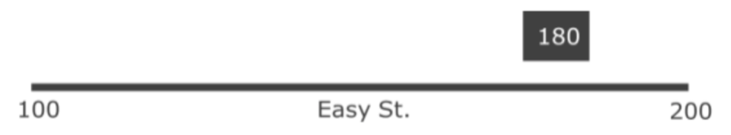
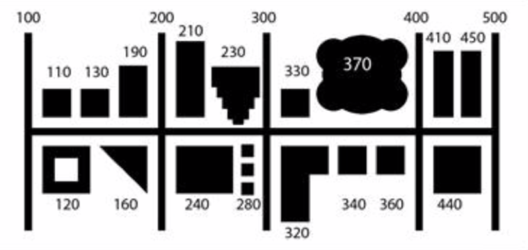

[Overview](./00_overview.md) |
[Introduction to spatial data](./01_introspatialdata.md) |
[Using spatial data](./02_usingspatialdata.md) |
[Closeout](./05_closeout.md)

# Using spatial data

| *120 min* |
| --------- |

## Standard spatial operations

| *30 min*  |
| --------- |

On vector data:
1. Selections – the basics of a spatial index (rtree)
2. Set geometry operations, buffering/ eroding, joining/dissolving, splitting using overlay operations (intersect, union, join)
3. Point in polygon algorithms as an introduction to spatial indices
4. Geocoding:
   1. Linear geocoding (find a point along a line, e.g. 191 St Georges) – estimate from start and end points of the block. Not as accurate but easy to implement and data is commonly available
     
   2. Area geocoding (find a point in a polygon) – much more accurate but requires lots more data
     
   3. Generally, we don’t just want to do this ourselves – use an API!

## Exercise: Geospatial data processing

| *60 min*  |
| --------- |

Open [am2_geospatial_data_processing.ipynb](../notebooks/am2_geospatial_data_processing.ipynb) and go through the notebook.

## Spatial predictions

| *30 min*  |
| --------- |

Spatial predictions in machine learning are related to spatial statistics and geostatistics.

### Why do we worry about space at all?

| *10 min*  |
| --------- |

[Tobler's first law of geography:](https://en.wikipedia.org/wiki/Tobler%27s_first_law_of_geography)

> Everything is related to everything else, but near things are more related than distant things.

To predict in space, each location is treated as a variable (same principle in time), and those variables are dependent.

### Covariance function

| *10 min*  |
| --------- |

If we want to make any prediction, we need to take that dependency into account. A traditional approach is to use a covariance function, which defines how the correlation between two locations changes with distance. In geostatistics, this function is usually a [variogram](https://www.youtube.com/watch?v=jVRLGOsnYuw), in machine learning a [kernel](https://scikit-learn.org/stable/modules/gaussian_process.html#kernels-for-gaussian-processes).

### Gaussian processes

| *10 min*  |
| --------- |

[Gaussian processes](https://scikit-learn.org/stable/modules/gaussian_process.html#gaussian-process) use the covariance function to determine the spatial continuity between each location during prediction. It is equivalent to [kriging](https://www.youtube.com/watch?v=CVkmuwF8cJ8), which is widely used for spatial predictions in geostatistics. Gaussian processes can interpolate between observations (i.e., they fit the data perfectly) and quantify the uncertainty of the prediction.

If you want to get a better idea at how Gaussian processes work, [Distill](https://distill.pub/2019/visual-exploration-gaussian-processes/) has made a nice, interactive explanation. You can find some examples of spatial predictions using Gaussian processes and other methods in the notebook linked in [this Agile blog post](https://agilescientific.com/blog/2019/3/8/x-lines-of-python-gridding-map-data). Finally, Michael Pyrcz has a great [set of lectures](https://www.youtube.com/channel/UCLqEr-xV-ceHdXXXrTId5ig) about statistics, geostatistics, and machine learning.
